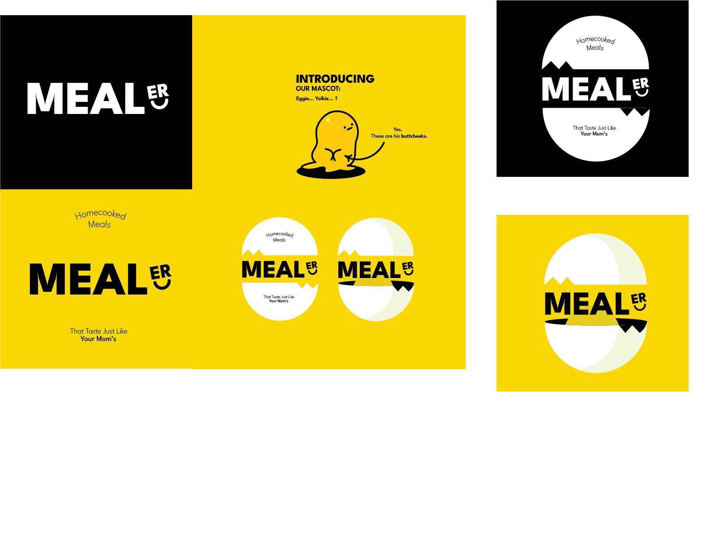

    

<h1 align="center">Mealer</h1>
<h4 align="center">SEG 2105 | Fall 2022</h4>
<h6 align="center">Katie Liu, Tess Harper, Elsa M. Ko, Jacob Maurice, Saranki Mahendran</h6>

    
    
    
    

An Ottawa-based meal-sharing application where local cooks can sell meals to clients from the
comfort of their home. Built with Android SDK and <a src="https://firebase.google.com/">Firebase</a>
.

This application supports three types of users:

> **Cooks:**
> - a user that offers meals to clients for purchase. 
> - can customize their menu by adding, removing, and modifying meals. 
> - may choose to not offer items for purchase from their menu.
> - can manage purchase requests from their profile page.

> **Clients:**
> - a user that requests to buy meals from cooks.
> - can search and filter for meals by name, cuisine, and/or meal type from the browsing page.
> - have the option to access and view a cook's profile from any meal result.
> - can view their purchase request history and monitor their purchase request's status from the homepage.
>  - if a purchase is accepted by the meal's respective cook, they are given the options to rate 
     and/or submit a complaint against the cook.

> **Administrators:**
a pre-registered user that manages complaints regarding particular cooks from clients. 
> If necessary, they may choose to suspend cooks and revoke their access to application features.
>
>
>   | Username | admin@mealer.com |
> |--|--|
> | Password | admin123! |

